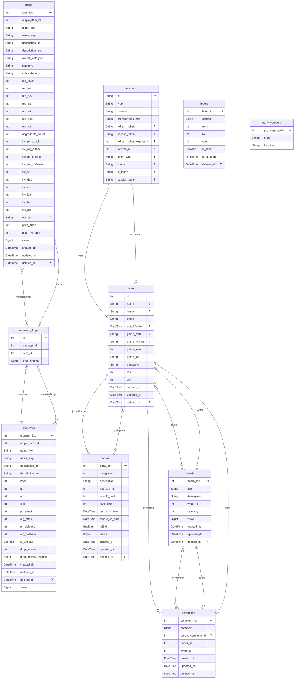

```mermaid
erDiagram

  "items" {
    Int item_idx "🗝️"
    Int maple_item_id
    String name_kor
    String name_eng
    String description_kor
    String description_eng
    String overall_category
    String category
    String sub_category
    Int req_level
    Int req_str
    Int req_dex
    Int req_int
    Int req_luk
    Int req_pop
    Int req_job
    Int upgradable_count
    Int inc_ph_attack
    Int inc_mg_attack
    Int inc_ph_defence
    Int inc_mg_defence
    Int inc_str
    Int inc_dex
    Int inc_int
    Int inc_luk
    Int inc_hp
    Int inc_mp
    String opt_etc "❓"
    Int price_shop
    Int price_average
    BigInt views
    DateTime created_dt
    DateTime updated_dt
    DateTime deleted_dt "❓"
    }


  "monster_drops" {
    Int id "🗝️"
    Int monster_id
    Int item_id
    String drop_chance
    }


  "monsters" {
    Int monster_idx "🗝️"
    Int maple_mob_id
    String name_kor
    String name_eng
    String description_kor
    String description_eng
    Int level
    Int hp
    Int mp
    Int exp
    Int ph_attack
    Int mg_attack
    Int ph_defence
    Int mg_defence
    Boolean is_undead
    Int drop_money
    String drop_money_chance
    DateTime created_dt
    DateTime updated_dt
    DateTime deleted_dt "❓"
    BigInt views
    }


  "Account" {
    String id "🗝️"
    String type
    String provider
    String providerAccountId
    String refresh_token "❓"
    String access_token "❓"
    Int refresh_token_expires_in "❓"
    Int expires_at "❓"
    String token_type "❓"
    String scope "❓"
    String id_token "❓"
    String session_state "❓"
    }


  "users" {
    Int id "🗝️"
    String name "❓"
    String image "❓"
    String email
    DateTime emailVerified "❓"
    String game_nick "❓"
    String game_tc_nick "❓"
    Int game_level
    String game_job
    String password
    Int role
    Int coin
    DateTime created_dt
    DateTime updated_dt
    DateTime deleted_dt "❓"
    }


  "letters" {
    Int letter_idx "🗝️"
    String content
    Int from
    Int to
    Int coin
    Boolean is_read
    DateTime created_dt
    DateTime deleted_dt "❓"
    }


  "parties" {
    Int party_idx "🗝️"
    Int categoryId
    String description
    Int recruiter_id
    Int people_limit
    Int level_limit
    DateTime recruit_st_time
    DateTime recruit_ed_time
    Boolean isEnd
    BigInt views
    DateTime created_dt
    DateTime updated_dt
    DateTime deleted_dt "❓"
    }


  "party_category" {
    Int pt_category_idx "🗝️"
    String name
    String location
    }


  "boards" {
    Int board_idx "🗝️"
    String title
    String description
    Int writer_id
    Int category
    BigInt views
    DateTime created_dt
    DateTime updated_dt
    DateTime deleted_dt "❓"
    }


  "comments" {
    Int comment_idx "🗝️"
    String comment
    Int parent_comment_id "❓"
    Int board_id
    Int writer_id
    DateTime created_dt
    DateTime updated_dt
    DateTime deleted_dt "❓"
    }

    "items" o{--}o "monster_drops" : "monsterDrops"
    "monster_drops" o|--|| "items" : "items"
    "monster_drops" o|--|| "monsters" : "monsters"
    "monsters" o{--}o "monster_drops" : "monsterDrops"
    "Account" o|--|| "users" : "user"
    "users" o{--}o "Account" : "accounts"
    "users" o{--}o "boards" : "posts"
    "users" o{--}o "comments" : "comments"
    "users" o{--}o "parties" : "joinedParties"
    "parties" o{--}o "users" : "participants"
    "boards" o|--|| "users" : "writer"
    "boards" o{--}o "comments" : "commnets"
    "comments" o|--|| "boards" : "board"
    "comments" o|--|| "users" : "writer"
```
